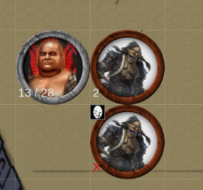

# Pathfinder 2 damage count

A simple modules that shows the damage taken by a token with an overlay

It's mostly just a wild test to see if a module could be writen in Python.

This module now uses brython instead of transcrypt removing the need to build it and allowing purer python use.

